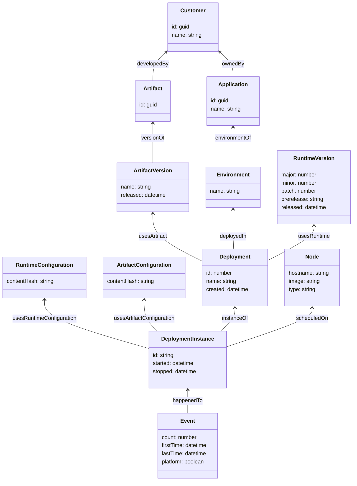
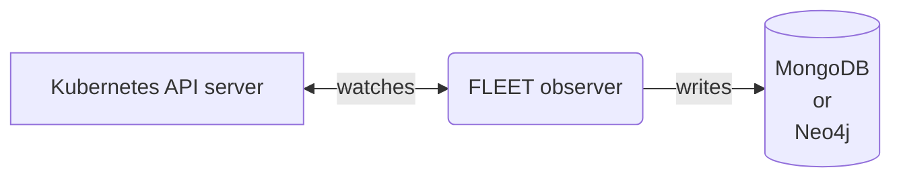
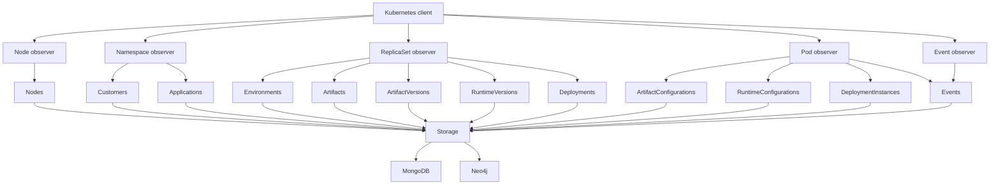

# FLEET-observer

The FLEET observer is a tool that observes a Kubernetes cluster of Dolittle resources, and stores data over time - that
can be exported to the FLEET model. It is highly specialised for the current Dolittle structure of Kubernetes resources
and highly experimental - so this is probably not what you're looking for.

## FLEET domain-model
The FLEET domain-model produced by the FLEET observer is defined by the following entities and relationships:


## Architecture
The main usage of the FLEET observer is the `observe` command. In this mode, the FLEET observer lists and watches all known resources in the Kubernetes API, transforms them into the FLEET domain-model entities, and persists the entities and links to either a MongoDB or Neo4j database.



Internally, there are multiple _observers_ that are responsible for listing and watching native Kubernetes _resources_. Whenever a change is detected (and at a regular sync-interval), thee resources are transformed into FLEET _entities_, and persisted to a _storage_ implementation. These transformations are pure functions, meaning that transforming the same resource and overwriting the resulting entities will not change the previous result. This means that (as long as the resources are not deleted in Kubernetes), the FLEET observer is stateless and should produce the same results every time it is run.



## Deployment
The FLEET observer is designed to be deployed in Kubernetes as a `Deployment`, using the [dolittle/fleet-observer](https://hub.docker.com/r/dolittle/fleet-observer) Docker image. It should be configured to persist data to either a MongoDB or a Neo4j database, and it needs to run with a `ServiceAccount` that has permissions to `get`, `list`, `watch` the following resources:
 - Nodes
 - Namespaces
 - ReplicaSets
 - Pods
 - Events

## Usage

The FLEET observer currently requires `Go 1.18`, and you can run it from source using `go run . <command>` from the root
of the repository.

### Command: Observe
````shell
Starts the observer

Usage:
  fleet-observer observe [flags]

Flags:
      --cleanup.interval string           The interval to run cleanup jobs (default "1m")
  -h, --help                              help for observe
      --kubernetes.sync-interval string   The Kubernetes informer sync interval (default "1m")

Global Flags:
      --config strings                     A configuration file to load, can be specified multiple times.
      --logger.format string               The logging format to use, 'json' or 'console'. (default "console")
      --logger.level string                The logging minimum log level to output. (default "info")
      --mongodb.connection-string string   The connection string to MongoDB (default "mongodb://localhost:27017/observer")
      --neo4j.connection-string string     The connection string string to Neo4j. If not set, MongoDB will be used as storage
      --neo4j.password string              The password to use for authenticating with Neo4j. If not set, authentication will not be performed.
      --neo4j.username string              The username to use for authenticating with Neo4j. (default "neo4j")
````

### Command: Export
````shell
$ go run . export -h
Exports the stored data in the database as NDJSON

Usage:
  fleet-observer export [flags]

Flags:
  -h, --help            help for export
      --output string   The output file to export to (default "./export.ndjson")

Global Flags:
      --config strings                     A configuration file to load, can be specified multiple times.
      --logger.format string               The logging format to use, 'json' or 'console'. (default "console")
      --logger.level string                The logging minimum log level to output. (default "info")
      --mongodb.connection-string string   The connection string to MongoDB (default "mongodb://localhost:27017/observer")
      --neo4j.connection-string string     The connection string string to Neo4j. If not set, MongoDB will be used as storage
      --neo4j.password string              The password to use for authenticating with Neo4j. If not set, authentication will not be performed.
      --neo4j.username string              The username to use for authenticating with Neo4j. (default "neo4j")
````

### Command: Drop
> Note: This command only works with MongoDB at the moment
````shell
$ go run . drop -h
Drops the stored data in the database

Usage:
  fleet-observer drop [flags]

Flags:
  -h, --help   help for drop

Global Flags:
      --config strings                     A configuration file to load, can be specified multiple times.
      --logger.format string               The logging format to use, 'json' or 'console'. (default "console")
      --logger.level string                The logging minimum log level to output. (default "info")
      --mongodb.connection-string string   The connection string to MongoDB (default "mongodb://localhost:27017/observer")
      --neo4j.connection-string string     The connection string string to Neo4j. If not set, MongoDB will be used as storage
      --neo4j.password string              The password to use for authenticating with Neo4j. If not set, authentication will not be performed.
      --neo4j.username string              The username to use for authenticating with Neo4j. (default "neo4j")
````
